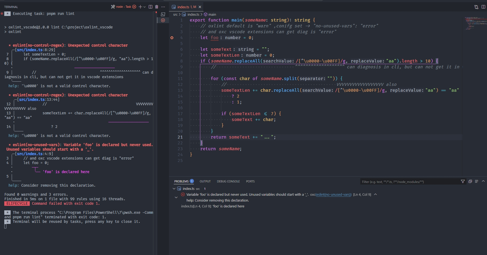
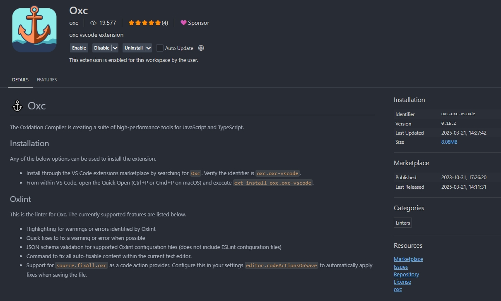
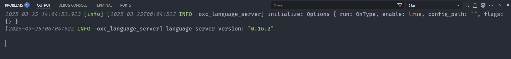

# oxc vscode extensions can not get some problems


```bash
pnpm oxlint -c .oxlintrc.json
# or
pnpm oxlint
# or
pnpm lint #
```


> get it


> oxc vscode extensions version:0.16.2


> [Oxc.log](./Oxc.log)
> copy from C:\Users\user\AppData\Roaming\Code\logs\20250325T140451\window1\exthost\oxc.oxc-vscode\Oxc.log
