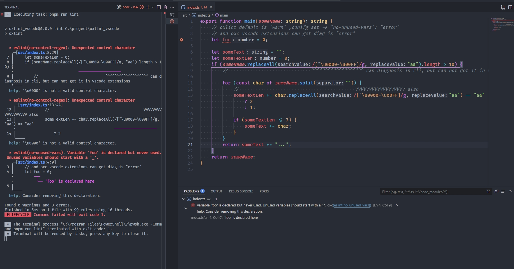
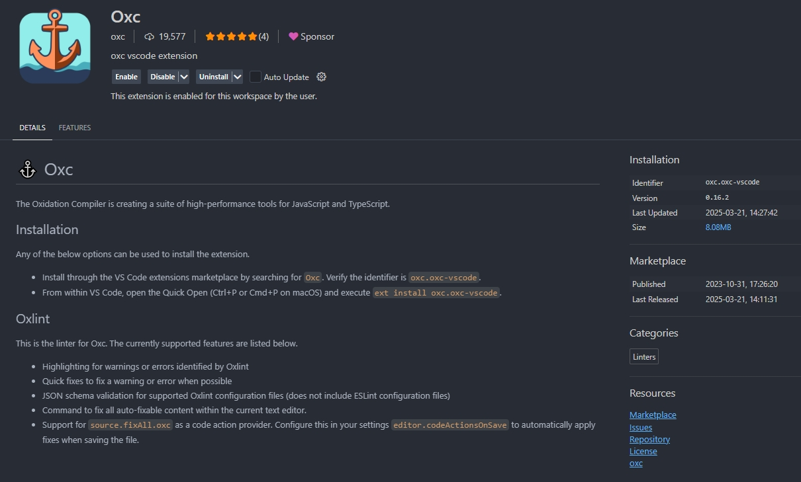
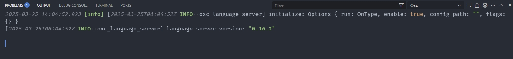

# oxc vscode extensions can not get some problems


```bash
pnpm oxlint -c .oxlintrc.json
# or
pnpm oxlint
# or
pnpm lint #
```


> get it

| line    | oxc cli     | vscode extensions |
| :------ | :---------- | :---------------- |
| line 4  | match error | match error       |
| line 8  | match error | not match         |
| line 11 | match error | not match         |

```jsonc
// .oxlintrc.json
{
    "ignorePatterns": [
        "**/*.js"
    ],
    "rules": {
        "no-control-regex": "error",
        "no-unused-vars": "error" // <- try to let it to "warn" / "off"
    }
}
```


> oxc vscode extensions version:0.16.2


> [Oxc.log](./Oxc.log)
> copy from C:\Users\user\AppData\Roaming\Code\logs\20250325T140451\window1\exthost\oxc.oxc-vscode\Oxc.log


```jsonc
{
    "oxc.trace.server": "verbose",
}
```

> [Oxc.log with verbose](verbose-Oxc.log)

